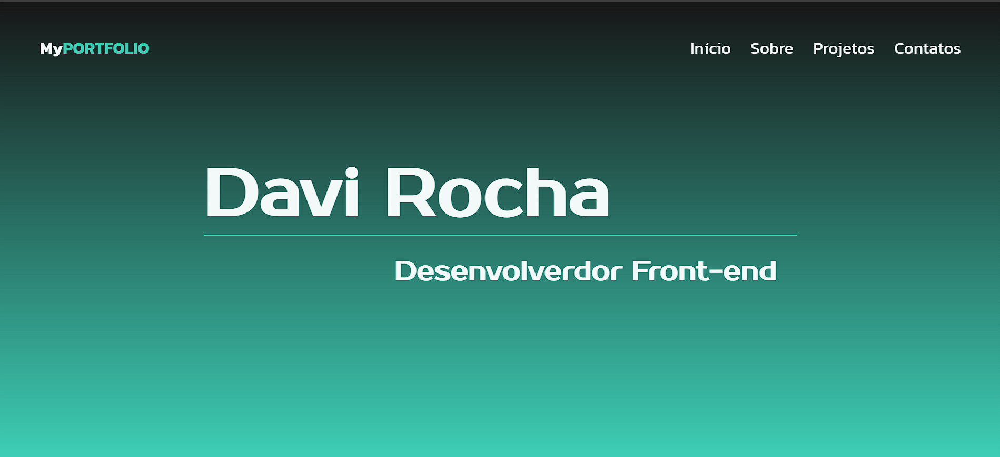

# Portfólio Pessoal - Davi Rocha

 # **[Link do projeto](https://davirrocha.github.io/portfolio/)**
 Este é o repositório do meu portfólio online, onde apresento minhas habilidades como desenvolvedor front-end e meus projetos.

## Tecnologias Utilizadas

* **HTML:** Estrutura do site.
* **CSS:** Estilização visual.
* **JavaScript:** Interatividade e dinamismo.

## Funcionalidades

* **Seções:** O portfólio é dividido em seções: Início, Sobre, Projetos e Contato.
* **Menu:** Menu de navegação para acesso rápido às seções.
* **Projetos:** Listagem de projetos com links para visualização.
* **Links Sociais:** Links para perfis no GitHub, LinkedIn e e-mail.

